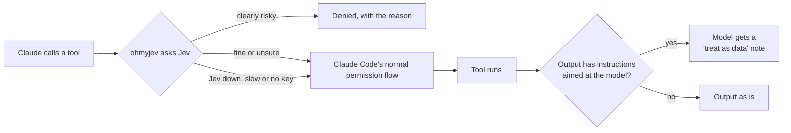

```
        _                          _
  ___  | |__   _ __ ___   _   _   (_)  ___  __   __
 / _ \ | '_ \ | '_ ` _ \ | | | |  | | / _ \ \ \ / /
| (_) || | | || | | | | || |_| |  | ||  __/  \ V /
 \___/ |_| |_||_| |_| |_| \__, | _/ | \___|   \_/
                          |___/ |__/
```

<p align="center">
  Guardrails for Claude Code, pi and omp, decided by <a href="https://typesafe.ai">Jev</a>.<br>
  One mod that blocks destructive commands, catches prompt injection, pushes back on an unverified "done" and routes effort per turn.
</p>

<p align="center">
  
  
  
  <a href="https://www.npmjs.com/package/ohmyjev"></a>
  
</p>

<p align="center">
  <a href="https://ohmyjev.xyz"><b>ohmyjev.xyz</b></a> ·
  <a href="#quick-start">Quick start</a> ·
  <a href="#what-you-get">What you get</a> ·
  <a href="#install">Install</a> ·
  <a href="#pi-and-omp">pi and omp</a> ·
  <a href="#using-it">Using it</a> ·
  <a href="#settings">Settings</a> ·
  <a href="#privacy">Privacy</a> ·
  <a href="#troubleshooting">Troubleshooting</a>
</p>

---

Jev is TypeSafe's decision model. You send it some state and a few typed questions, and it sends back probabilities
in about 300 ms for a fraction of a cent. That's fast and cheap enough to ask about every command your agent runs, so
ohmyjev does exactly that. It runs as in-process hooks inside Claude Code, which means no extra process and no server
to keep up.

## Quick start

```bash
export TYPESAFE_API_KEY=ts_...        # put this in your shell profile
```

Then start Claude Code and run:

```
/plugin install ohmyjev --marketplace Novacon/ohmyjev
/omj
```

If `/omj` ends with `key: env TYPESAFE_API_KEY · typesafe · jev-1.13.0`, you're set.

## What you get

| Feature | What it does |
|---|---|
| **Bash gate** | Denies a command when Jev rates it irreversible at 0.6 or more. A command Jev calls irreversible with less confidence is denied too when it also aims to wipe something (0.7). A reversible command always passes, so deleting lines, dropping a co-author trailer or uninstalling a plugin goes through. |
| **Write gate** | Denies writes outside the repo and `allowPaths`, and writes that contain a real credential. The repo means every worktree of the one the session started in, and every worktree of a repo the agent has moved into. The path check is plain code, not Jev, and it follows symlinks the way the OS does. |
| **Exfil gate** | Denies a WebFetch or MCP call when Jev rates it 0.7 or more for sending your local data, files or credentials out. |
| **Policies** | Every gate also checks the call against your own rules in the `policies` setting. |
| **Your request** | Every gate also asks Jev whether your latest message asked for exactly this call. If it did (0.8), a gate's Jev deny lets the call through. So "delete the build folder" or "force push it" works, while the same command picked by the agent on its own is still denied. Policy and path denies always stand. |
| **Injection screen** | When output from Bash, WebFetch, an MCP tool, or a Read outside the repo has instructions aimed at the model, it adds a note telling the model to treat that output as data. |
| **Done-check** | If the agent says it's done but nothing shows it ran a check, it blocks the stop once and tells the agent to verify. A turn that ran no tools is never blocked, since there was nothing to verify. |
| **Router** | Asks Jev once per request for a tier, an effort level and a risk score. Then it raises or lowers effort and picks the model for general-purpose subagents. With no key it falls back to Claude Code's built-in classifier, which reports no confidence, so then it only ever routes up. |
| **Auto-compact** | When the task changes after a finished step and the context is at least 40% full, it compacts the conversation. The summary keeps the new request in full. |
| **`ask_jev`** | A tool the model can use to ask Jev about repo files or text without loading them into its own context. |
| **`/omj`** | This session's Jev calls, errors, cost, median latency and denies, and where the key comes from. It never prints the key. `/omj stats` opens a dashboard of every session in your browser. `/omj off` and `/omj on` switch ohmyjev for the session. `/ohmyjev` is the same command. |

### How a tool call goes through it



Anything ohmyjev doesn't deny just goes on to Claude Code's normal permission flow. That covers middling answers, Jev
being down or slower than `timeoutMs` (1.5 s), a missing key, and any error inside ohmyjev. It never stops to ask you to approve
anything, so it works fine with agents running in bypass mode. Jev can be wrong though, so keep your deny rules in
`settings.json`.

## Install

### 1. Check what you need

- **Claude Code 2.1.287 or later.** Mods are still early access. Run `claude --version` to check.
- **A Jev key.** Either a TypeSafe key, or an OpenRouter key if you'd rather go through OpenRouter.

### 2. Install the plugin

Run this at the prompt of a terminal Claude Code session:

```
/plugin install ohmyjev --marketplace Novacon/ohmyjev
```

Answer `y` to add the marketplace, then pick a scope. User scope is the first option and turns ohmyjev on for every
session. Once it says `Installed ohmyjev`, the hooks are already running in that session, so there's nothing to
restart.

You can also do it from your shell:

```bash
claude plugin marketplace add Novacon/ohmyjev
claude plugin install ohmyjev@ohmyjev
```

### 3. Add your key

You've got three options, in the order ohmyjev looks for them:

1. **The settings screen.** During the install, ohmyjev shows a screen with its options, including the TypeSafe
   key. Claude Code keeps it in secure storage, not in a settings file.
2. **`TYPESAFE_API_KEY`** in your environment, for example in `~/.zshrc`.
3. **`OPENROUTER_API_KEY`** in your environment. ohmyjev then calls Jev through OpenRouter as `~typesafe/jev-latest`.

### 4. Check it works

Start a session and run `/omj`. The last line tells you where the key came from:

```
key: env TYPESAFE_API_KEY · typesafe · jev-1.13.0
```

If it says `key: none`, ohmyjev can't see a key. In that case every gate stays open, the router falls back to Claude
Code's built-in classifier (up only), and the status under the prompt shows `jev ⚠ no key`.

## pi and omp

The same checks run in [pi](https://pi.dev) and [omp](https://github.com/can1357/oh-my-pi) as a native extension.
They share the decision logic and the key lookup (`TYPESAFE_API_KEY`, then `OPENROUTER_API_KEY`) with the Claude Code
plugin, and write to the same `~/.ohmyjev` logs, so `/omj` and the statusline segment work the same way.

### omp

```bash
omp plugin install ohmyjev
```

That installs the npm package; `omp plugin install github:Novacon/ohmyjev` installs straight from GitHub instead. Or use
the marketplace this repo already serves: `/marketplace add Novacon/ohmyjev`, then `/marketplace install ohmyjev@ohmyjev`.
Restart the session after installing. Settings use the names in [Settings](#settings):

```bash
omp plugin config list ohmyjev
omp plugin config set ohmyjev routeMainModel true
```

The router's tiers default to omp's own model roles: `@smol`, `@default` and `@slow`.

### pi

```bash
pi install npm:ohmyjev
```

Or straight from GitHub: `pi install git:github.com/Novacon/ohmyjev`.

pi has no settings screen for extensions, so put yours under an `ohmyjev` key in `~/.pi/agent/settings.json`, or in
`.pi/settings.json` for one project (project values win):

```json
{ "ohmyjev": { "routeMainModel": true, "fastModel": "anthropic/claude-haiku-5-5" } }
```

### What differs

| | Claude Code | omp | pi |
|---|---|---|---|
| Bash gate | Bash | `bash`, `eval`, and `github` pushes and PRs | `bash`, `powershell` |
| Write gate | Write, Edit, NotebookEdit | `write`, `edit` (patches and renames included), `ast_edit` | `write`, `edit` |
| Exfil gate | WebFetch, MCP tools | `read` of a URL, MCP tools | MCP tools (pi has no fetch tool; `curl` goes through the bash gate) |
| Injection screen | Bash, WebFetch, MCP, Reads outside the repo | `bash`, `github`, URL reads, MCP, reads outside the repo | `bash`, `powershell`, MCP, reads outside the repo |
| Done-check | ✓ | ✓ | ✓ |
| Router effort | ✓ | ✓ (left alone while you're on `auto`) | ✓ |
| Router subagent model | general-purpose subagents | subagents on the default `task` role | none: pi has no subagents |
| Router without a key | Claude Code's built-in classifier, up only | off: omp has no separate classifier call for extensions | the cheapest model you've set up, up only |
| Decision lines | in the transcript | notifications | notifications |
| Status | under the prompt | in the footer | in the footer |

## Using it

Most of the time you won't notice it. Here's what it looks like when it does step in.

### When a command gets blocked

Claude gets the denial as the tool's result, with an instruction not to work around it and a way out:

```
ohmyjev blocked this: irreversible (0.95): nothing would restore what this removes or overwrites.
Do not try to work around it with another command, another tool, a different path, or an encoding that does
the same thing. Tell the user what was blocked and why. If they reply asking for exactly this, in words that
name it, run it again: their request then lets it through.
```

So when the agent stops and tells you, answer with the action itself, for example "yes, delete ~/.agentmemory".
A bare "yes" may not be enough, because the gate judges your latest message on its own.

A write outside the repo gets a different message. It names the path and tells the model to ask you to add that
directory to `allowPaths`, because that block is a setting, not a hazard.

### `/omj`

Run it any time for this session's numbers. `/ohmyjev` is the same command, and `/omj settings` lists every setting's
value. An example:

```
jev ✓23 ⛔1 ↑opus/high
calls 23 · errors 0 · cost $0.000966 · p50 310ms
denies: Bash 1
  Bash: irreversible (0.95): nothing would restore what this removes or overwrites
key: env TYPESAFE_API_KEY · typesafe · jev-1.13.0
```

### Your own rules

Put plain-English rules in the `policies` setting, separated by `;`. Every gate then asks Jev whether the call breaks
one of them:

```
never touch the prod cluster; no deploys on Friday; don't edit migrations that already ran
```

### `ask_jev`

The model can call this tool on its own when it needs a judgment about files without reading them. For example:

```json
{
  "question": "Which of these files handles session login?",
  "type": "choice",
  "options": ["src/auth.ts", "src/session.ts", "src/routes.ts"],
  "files": ["src/auth.ts", "src/session.ts", "src/routes.ts"]
}
```

Jev reads the files, not the model. ohmyjev only sends files that are inside the repo, up to 8000 characters each and
80000 in total.

### In the transcript

Each routing decision shows up as a dim line in the transcript. The model never sees these lines. First what Jev
said, then what the router did with it:

```
[ohmyjev] ready: Jev via typesafe (jev-1.13.0, key from env TYPESAFE_API_KEY)
[ohmyjev] jev: tier fast (0.41) · effort 0.4 (0.38) · risky 0.01 · 210ms
[ohmyjev] main loop kept opus/medium, wanted opus/low (confidence 0.38)
```

The last line is the router declining to act: it wanted to spend less, but 0.38 is under the 0.6 it takes to move
down. In a `claude -p` or SDK run the same lines arrive as `ui_log` messages and in the debug log. Turn them off with
`logDecisions`.

### `/omj stats`

Builds one page from every session's log at `~/.ohmyjev/dashboard.html` and opens it in your browser. It has the
totals, a 30-day chart of calls and denies, a table per tool and per session, and the latest denies with their reasons.
It is a plain file built from the logs, so nothing on it leaves the machine. The page loads its fonts from ohmyjev.xyz
and falls back to system fonts offline.

### `/omj off`

Turns every gate, the screen, the done-check and the router off for this session. The status shows `jev off`.
`/omj on` brings them back. To start every session off, turn off the `enabled` setting.

### Status line

ohmyjev pins its status under the prompt, so there's nothing to set up:

```
jev ✓23 ⛔1 ↑opus/high 🗜2     Jev calls, denies, this turn's route, auto-compactions
jev ⚠ down                    Jev failed or timed out in the last 5 minutes, so the gates let calls through
jev ⚠ no key                  no key configured
jev off                       turned off with /omj off, or the enabled setting
```

If you'd rather have it in your own statusline script, copy `jev_segment()` from
[`extras/statusline_segment.py`](extras/statusline_segment.py) into it and add the segment wherever you like. It
reads one small file per session, so it's quick. Turn the built-in one off with `statusLine`.

```python
jev = jev_segment(data.get("session_id"))   # data = the statusline JSON from stdin
if jev:
    parts.append(jev)
```

## Settings

Run `/omj settings` to see every setting's current value (the key stays hidden). To change them, run
`/plugin configure ohmyjev@ohmyjev` inside Claude Code, then `/reload-plugins`.

| Setting | Default | What it changes |
|---|---|---|
| `enabled` | on | The whole mod. Off lets every call through; `/omj on` and `/omj off` change it for one session. |
| `bashGate`, `writeGate`, `exfilGate` | on | Turns each gate on or off. |
| `injectionScreen`, `screenReads` | on | Screens tool output, including Reads from outside the repo. |
| `doneCheck` | on | Pushes back on an unverified "done". |
| `routeEffort`, `routeSubagents` | on | Lets the router change effort and the subagent model. |
| `routeMainModel` | off | Also switches the main model. It's off because switching models throws away the prompt cache. |
| `routeWithoutKey` | on | With no key, routes with Claude Code's built-in classifier instead. It has no confidence, so it only routes up. |
| `autoCompact` | on | Compacts when the task changes. `compactMinPercent` (40) sets how full the context has to be first. |
| `askJev` | on | Gives the model the `ask_jev` tool. |
| `policies` | empty | Your own rules, separated by `;`. |
| `allowPaths` | `~/.claude;$TMPDIR;/tmp` | Places outside the repo where writes are allowed. ohmyjev ignores any entry with `..` in it. You don't need it for a sibling worktree or another git repo the agent `cd`s into: those count as the repo. |
| `fastModel`, `balancedModel`, `deepModel` | `claude-haiku-5-5`, `claude-sonnet-5-5`, `claude-opus-5-5` | The model id for each router tier. |
| `jevModel` | `jev-1.13.0` | The Jev model asked through TypeSafe. |
| `timeoutMs` | 1500 | How long a gate, the screen or the router waits for Jev before letting the call through. |
| `logDecisions` | on | Shows each routing decision as a line in the transcript. |
| `statusLine` | on | Pins ohmyjev's status under the prompt. |

Each gate also has its own threshold setting, and `requested` (0.8) sets how sure Jev must be that you asked for a
call. The defaults are the numbers in [What you get](#what-you-get).

## Logs

Every decision gets one line in `~/.ohmyjev/log/<session>.jsonl`, and only you can read it. The log holds the
verdict, Jev's probabilities, the latency and the cost, never your commands' output. ohmyjev doesn't wait on that
write, so if one fails you lose that line and nothing else.

## Privacy

With a key set, ohmyjev sends Jev (TypeSafe, or OpenRouter with an OpenRouter key) only what each decision needs, cut to
a fixed size:

| What asks | What it sends |
|---|---|
| Bash gate | The command (up to 16000 characters), the working directory, the tool call's description and your latest message (1500) |
| Write gate | The file path and the new content (up to 16000 characters). Code denies writes outside the repo and `allowPaths` before it sends anything |
| Exfil gate | The tool's name and its input (up to 4000 characters) |
| Injection screen | The tool's output (up to 6000 characters), from Bash, WebFetch, MCP tools and Reads outside the repo |
| Done-check | The current request (600), up to five earlier requests (200 each), up to 20 of this turn's tool calls with their input (200 each) and outcome, and Claude's last message (1500) |
| Router | The request (up to 1500 characters) |
| `ask_jev` | The model's question, any text it passes (up to 20000 characters) and the repo files it names (8000 each, 80000 in total). It never sends files outside the repo |

The write and exfil gates also send your latest message (1500), for the request check. When you've set `policies`,
every gate sends those too. Turning a feature off stops its calls.

With no key, nothing goes to Jev. The router's built-in classifier sends the request (up to 1500 characters) to
Claude's own small model, over the same connection Claude Code already uses. In pi it goes to the cheapest model you
have set up, through pi's own provider. Logs and session files stay in `~/.ohmyjev`, readable only by you.

## Update or remove

```bash
claude plugin update ohmyjev@ohmyjev      # then restart Claude Code
claude plugin uninstall ohmyjev@ohmyjev

omp plugin upgrade ohmyjev                # omp; restart the session
omp plugin uninstall ohmyjev

pi update npm:ohmyjev                     # pi
pi remove npm:ohmyjev
```

## Troubleshooting

**The status says `jev ⚠ no key`.** ohmyjev can't find a key. Set `TYPESAFE_API_KEY` in the shell that starts
Claude Code, or enter the key with `/plugin configure ohmyjev@ohmyjev`.

**The status says `jev ⚠ down`.** A Jev call failed or took longer than `timeoutMs` (1.5 s) in the last 5 minutes. The
gates let calls through until Jev answers again. `/omj` shows the error count.

**Something got blocked that shouldn't have.** `/omj` shows the reason and Jev's numbers. Raise that gate's threshold
with `/plugin configure ohmyjev@ohmyjev`, or turn the gate off. Local MCP tools sometimes trip the exfil gate, and `exfilGate` is the switch for
that.

**Nothing seems to happen.** The first transcript line of a session should be `[ohmyjev] ready: …` or `[ohmyjev] no
Jev key: …`. If neither shows, run `claude --debug`: if a hook fails, the debug log has a line naming it and the
reason.

## Develop

```bash
git clone https://github.com/Novacon/ohmyjev && cd ohmyjev && bun install
claude --plugin-dir "$PWD"                  # run your working copy, and it writes the API types to .claude-plugin/types
omp -e ./adapters/omp.ts                    # or: pi -e ./adapters/pi.ts
bun run test && bun run typecheck && claude plugin validate .
```

The decision logic lives in `hooks/policy.ts` and is pure, so you can test it with plain tables. `hooks/ohmyjev.ts`
wires it to Claude Code; `adapters/omp.ts` and `adapters/pi.ts` wire it to omp and pi through `adapters/shared.ts`.
The design and plans are in [`docs/superpowers`](docs/superpowers).

## Credits

The question rubrics come from [disler/ten-levels-of-jev](https://github.com/disler/ten-levels-of-jev). MIT license.
