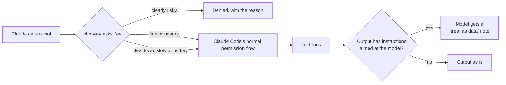

```
        _                          _
  ___  | |__   _ __ ___   _   _   (_)  ___  __   __
 / _ \ | '_ \ | '_ ` _ \ | | | |  | | / _ \ \ \ / /
| (_) || | | || | | | | || |_| |  | ||  __/  \ V /
 \___/ |_| |_||_| |_| |_| \__, | _/ | \___|   \_/
                          |___/ |__/
```

<p align="center">
  Guardrails for Claude Code, decided by <a href="https://typesafe.ai">Jev</a>.<br>
  One mod that blocks destructive commands, catches prompt injection, pushes back on an unverified "done" and routes effort per turn.
</p>

<p align="center">
  
  
  
</p>

<p align="center">
  <a href="https://ohmyjev.xyz"><b>ohmyjev.xyz</b></a> ·
  <a href="#quick-start">Quick start</a> ·
  <a href="#what-you-get">What you get</a> ·
  <a href="#install">Install</a> ·
  <a href="#using-it">Using it</a> ·
  <a href="#settings">Settings</a> ·
  <a href="#troubleshooting">Troubleshooting</a>
</p>

---

Jev is TypeSafe's decision model. You send it some state and a few typed questions, and it sends back probabilities
in about 300 ms for a fraction of a cent. That's fast and cheap enough to ask about every command your agent runs, so
ohmyjev does exactly that. It runs as in-process hooks inside Claude Code, which means no extra process and no server
to keep up.

## Quick start

```bash
export TYPESAFE_API_KEY=ts_...        # put this in your shell profile
```

Then start Claude Code and run:

```
/plugin install ohmyjev --marketplace Novacon/ohmyjev
/jev
```

If `/jev` ends with `key: env TYPESAFE_API_KEY · typesafe · jev-1.13.0`, you're set.

## What you get

| Feature | What it does |
|---|---|
| **Bash gate** | Denies a command when Jev rates it irreversible at 0.6 or more, or destructive at 0.7 or more. |
| **Write gate** | Denies writes outside the repo and `allowPaths`, and writes that contain a real credential. The path check is plain code, not Jev, and it follows symlinks the same way the OS does. |
| **Exfil gate** | Denies a WebFetch or MCP call when Jev rates it 0.7 or more for sending your local data, files or credentials out. |
| **Policies** | Every gate also checks the call against your own rules in the `policies` setting. |
| **Injection screen** | When output from Bash, WebFetch, an MCP tool, or a Read outside the repo has instructions aimed at the model, it adds a note telling the model to treat that output as data. |
| **Done-check** | If the agent says it's done but nothing shows it ran a check, it blocks the stop once and tells the agent to verify. |
| **Router** | Asks Jev once per request for a tier, an effort level and a risk score. Then it raises or lowers effort and picks the model for general-purpose subagents. |
| **Auto-compact** | When the task changes after a finished step and the context is at least 40% full, it compacts the conversation. The summary keeps the new request in full. |
| **`ask_jev`** | A tool the model can use to ask Jev about repo files or text without loading them into its own context. |
| **`/jev`** | Shows this session's Jev calls, errors, cost, median latency and denies, plus where the key comes from. It never prints the key itself. |

### How a tool call goes through it



Anything ohmyjev doesn't deny just goes on to Claude Code's normal permission flow. That covers middling answers, Jev
being down or slower than 1.5 s, a missing key, and any error inside ohmyjev. It never stops to ask you to approve
anything, so it works fine with agents running in bypass mode. Jev can be wrong though, so keep your deny rules in
`settings.json`.

## Install

### 1. Check what you need

- **Claude Code 2.1.287 or later.** Mods are still early access. Run `claude --version` to check.
- **A Jev key.** Either a TypeSafe key, or an OpenRouter key if you'd rather go through OpenRouter.

### 2. Install the plugin

Run this at the prompt of a terminal Claude Code session:

```
/plugin install ohmyjev --marketplace Novacon/ohmyjev
```

Answer `y` to add the marketplace, then pick a scope. User scope is the first option and turns ohmyjev on for every
session. Once it says `Installed ohmyjev`, the hooks are already running in that session, so there's nothing to
restart.

You can also do it from your shell:

```bash
claude plugin marketplace add Novacon/ohmyjev
claude plugin install ohmyjev@ohmyjev
```

### 3. Add your key

You've got three options, in the order ohmyjev looks for them:

1. **The settings screen.** During the install, ohmyjev shows a screen with its options, including the TypeSafe
   key. Claude Code keeps it in secure storage, not in a settings file.
2. **`TYPESAFE_API_KEY`** in your environment, for example in `~/.zshrc`.
3. **`OPENROUTER_API_KEY`** in your environment. ohmyjev then calls Jev through OpenRouter as `~typesafe/jev-latest`.

### 4. Check it works

Start a session and run `/jev`. The last line tells you where the key came from:

```
key: env TYPESAFE_API_KEY · typesafe · jev-1.13.0
```

If it says `key: none`, ohmyjev can't see a key. In that case every gate stays open and the statusline shows
`jev ⚠ no key`.

## Using it

Most of the time you won't notice it. Here's what it looks like when it does step in.

### When a command gets blocked

Claude gets the denial as the tool's result, along with an instruction not to work around it:

```
ohmyjev blocked this: irreversible (0.95): nothing would restore what this removes or overwrites.
This block is final. Do not try to work around it with another command, another tool, a different path,
or an encoding that does the same thing. Stop and tell the user what was blocked and why.
```

### `/jev`

Run it any time to see what this session has been up to. Here's an example:

```
jev ✓23 ⛔1 ↑opus/high
calls 23 · errors 0 · cost $0.000966 · p50 310ms
denies: Bash 1
  Bash: irreversible (0.95): nothing would restore what this removes or overwrites
key: env TYPESAFE_API_KEY · typesafe · jev-1.13.0
```

### Your own rules

Put plain-English rules in the `policies` setting, separated by `;`. Every gate then asks Jev whether the call breaks
one of them:

```
never touch the prod cluster; no deploys on Friday; don't edit migrations that already ran
```

### `ask_jev`

The model can call this tool on its own when it wants a quick judgment without reading a pile of files. For example:

```json
{
  "question": "Which of these files handles session login?",
  "type": "choice",
  "options": ["src/auth.ts", "src/session.ts", "src/routes.ts"],
  "files": ["src/auth.ts", "src/session.ts", "src/routes.ts"]
}
```

Jev reads the files, not the model. ohmyjev only sends files that are inside the repo, up to 8000 characters each and
80000 in total.

### Statusline

If you've got your own statusline script, copy `jev_segment()` from
[`extras/statusline_segment.py`](extras/statusline_segment.py) into it and add the segment wherever you like:

```python
jev = jev_segment(data.get("session_id"))   # data = the statusline JSON from stdin
if jev:
    parts.append(jev)
```

It reads one small file per session, so it's quick. Here's what it shows:

```
jev ✓23 ⛔1 ↑opus/high 🗜2     Jev calls, denies, this turn's route, auto-compactions
jev ⚠ down                    Jev failed or timed out in the last 5 minutes, so the gates let calls through
jev ⚠ no key                  no key configured
```

## Settings

Every setting except the key is a row in `/config`. Run `claude plugin configure ohmyjev@ohmyjev` to see them all and
which ones are still unset.

| Setting | Default | What it changes |
|---|---|---|
| `bashGate`, `writeGate`, `exfilGate` | on | Turns each gate on or off. |
| `injectionScreen`, `screenReads` | on | Screens tool output, including Reads from outside the repo. |
| `doneCheck` | on | Pushes back on an unverified "done". |
| `routeEffort`, `routeSubagents` | on | Lets the router change effort and the subagent model. |
| `routeMainModel` | off | Also switches the main model. It's off because switching models throws away the prompt cache. |
| `autoCompact` | on | Compacts when the task changes. `compactMinPercent` (40) sets how full the context has to be first. |
| `askJev` | on | Gives the model the `ask_jev` tool. |
| `policies` | empty | Your own rules, separated by `;`. |
| `allowPaths` | `~/.claude;$TMPDIR;/tmp` | Places outside the repo where writes are allowed. ohmyjev ignores any entry with `..` in it. |
| `fastModel`, `balancedModel`, `deepModel` | `claude-haiku-5-5`, `claude-sonnet-5-5`, `claude-opus-5-5` | The model id for each router tier. |
| `jevModel` | `jev-1.13.0` | The Jev model asked through TypeSafe. |

Each gate also has its own threshold setting. The defaults are the numbers in [What you get](#what-you-get).

## Logs

Every decision gets one line in `~/.ohmyjev/log/<session>.jsonl`, and only you can read it. The log holds the
verdict, Jev's probabilities, the latency and the cost, never your commands' output. ohmyjev doesn't wait on that
write, so if one fails you lose that line and nothing else.

## Update or remove

```bash
claude plugin update ohmyjev@ohmyjev      # then restart Claude Code
claude plugin uninstall ohmyjev@ohmyjev
```

## Troubleshooting

**The statusline says `jev ⚠ no key`.** ohmyjev can't find a key. Set `TYPESAFE_API_KEY` in the shell that starts
Claude Code, or enter the key with `claude plugin configure ohmyjev@ohmyjev`.

**The statusline says `jev ⚠ down`.** A Jev call failed or took longer than 1.5 s in the last 5 minutes. The gates let
calls through until Jev answers again. `/jev` shows the error count.

**Something got blocked that shouldn't have.** `/jev` shows the reason and Jev's numbers. Raise that gate's threshold
in `/config`, or turn the gate off. Local MCP tools sometimes trip the exfil gate, and `exfilGate` is the switch for
that.

**Nothing seems to happen.** Run `claude --debug`. If a hook fails, the debug log has a line naming it and the reason.

## Develop

```bash
git clone https://github.com/Novacon/ohmyjev && cd ohmyjev
claude --plugin-dir "$PWD"                  # run your working copy, and it writes the API types to .claude-plugin/types
claude plugin test . && claude plugin validate . && bunx -p typescript@5.6.3 tsc -p .
```

The decision logic lives in `hooks/policy.ts` and is pure, so you can test it with plain tables. `hooks/ohmyjev.ts`
wires it to Claude Code. The design and plans are in [`docs/superpowers`](docs/superpowers).

## Credits

The question rubrics come from [disler/ten-levels-of-jev](https://github.com/disler/ten-levels-of-jev). MIT license.
